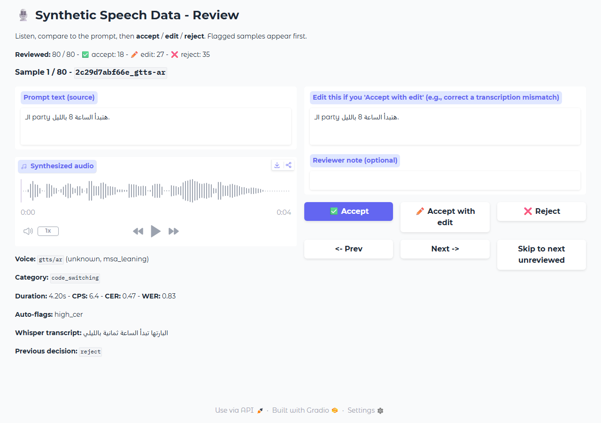
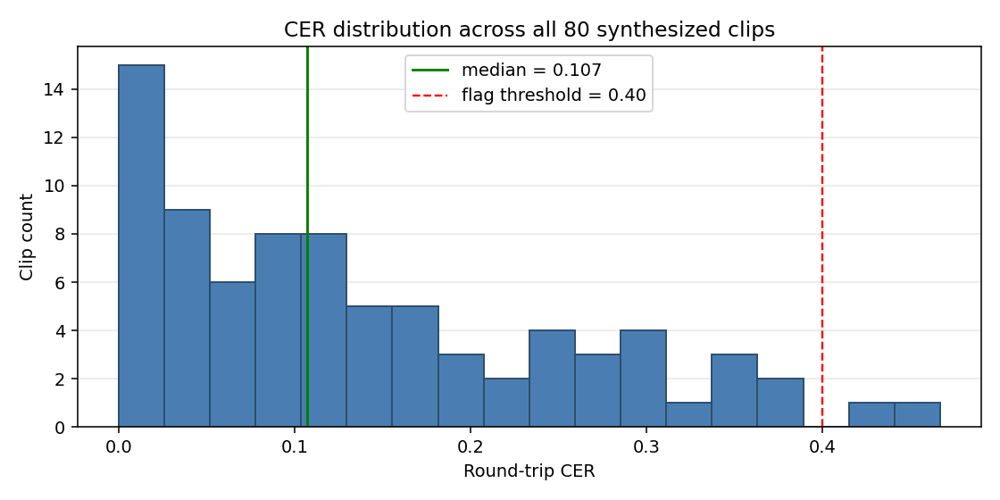
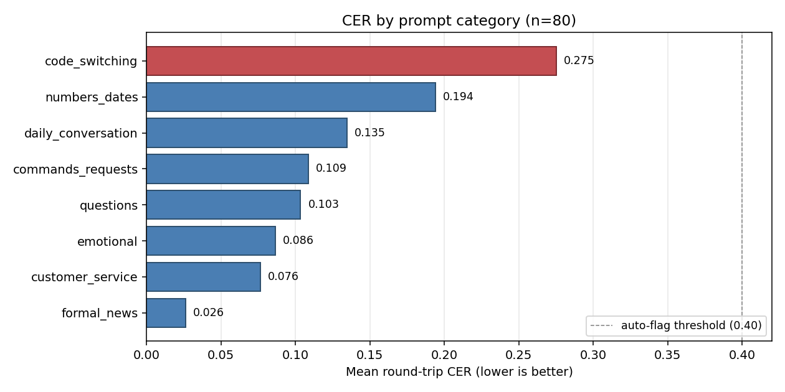
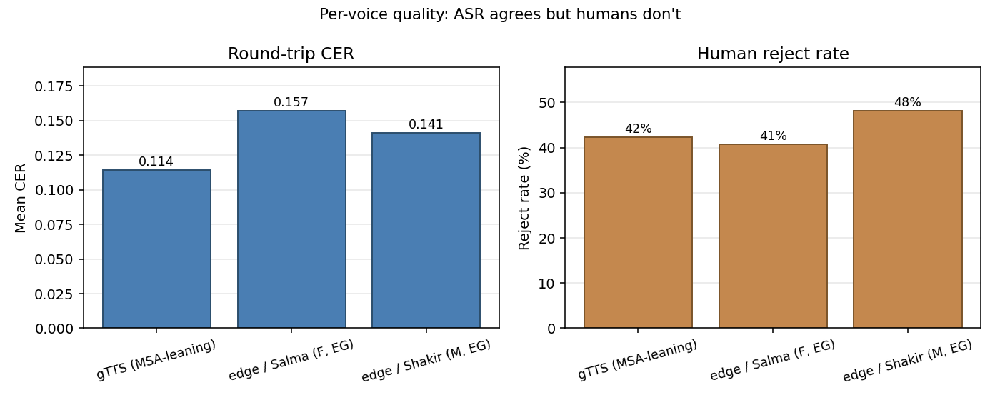

# Synthetic Speech Data Pipeline (S.S.D.P.)

A four-stage pipeline that produces a training-ready synthetic speech dataset for **Egyptian Arabic** STT fine-tuning.

```
[1] Prompt generation        ->  data/prompts/prompts.jsonl
[2] TTS synthesis            ->  data/audio/*.wav  +  data/audio/audio.jsonl
[2.5] Auto quality signals   ->  data/reviewed/quality.jsonl
[3] Human review (Gradio)    ->  data/reviewed/reviewed.jsonl
[4] Export (HuggingFace)     ->  data/final/egyptian_arabic_synthetic_v1/
```

Every stage is **resumable**: each writes an append-only JSONL manifest, and rerunning the stage skips work that already has a successful entry.



---

## Quickstart

```bash
# 1. Python 3.12 venv + deps
py -3.12 -m venv .venv
.venv\Scripts\activate         # Windows
# source .venv/bin/activate    # macOS / Linux
pip install -r requirements.txt

# 2. ffmpeg (one of):
winget install Gyan.FFmpeg     # Windows
# brew install ffmpeg          # macOS
# sudo apt install ffmpeg      # Debian/Ubuntu

# 3. OpenAI key
cp .env.example .env           # then edit .env, paste your key

# 4. Run the non-interactive stages
python -m src.pipeline --stage all

# 5. Launch the Gradio reviewer (open http://127.0.0.1:7860)
python -m src.pipeline --stage review

# 6. Export after reviewing
python -m src.pipeline --stage export
```

`--stage all` runs prompts -> tts -> quality. Review and export are not in `all` because review is interactive (would hang in CI) and export should follow review. First run downloads the Whisper `small` model (~244 MB) to `~/.cache/huggingface/`.

---

## Pipeline stages

**Stage 1 - Prompts** ([src/prompts.py](src/prompts.py)). Generates Egyptian Arabic via `gpt-4o-mini`. Each of 8 categories has its own Arabic system prompt with explicit dialect markers (إزيك، عايز، كده) - generic "Egyptian Arabic" requests drift toward MSA. Every candidate is cleaned, length-checked, Arabic-content-checked, and hashed for dedup. Cost: ~$0.02 / 80 prompts.

**Stage 2 - TTS** ([src/tts.py](src/tts.py)). Three free voices, one per prompt round-robin: `edge-tts ar-EG-SalmaNeural` (F), `edge-tts ar-EG-ShakirNeural` (M), `gTTS ar` (MSA-leaning, included as a contrast voice for acoustic diversity). Async with a Semaphore at 8 in-flight. Output is 16kHz mono PCM_16 WAV - the canonical STT input. Tenacity retries on every provider call; per-sample isolation so one bad clip doesn't kill the run.

**Stage 2.5 - Quality signals** ([src/quality.py](src/quality.py)). Three automated checks per clip: round-trip ASR with faster-whisper (`small`, int8 CPU) compared to source via Arabic-aware normalization (alef variants, ta-marbuta, digits, diacritics); duration sanity; chars/sec speaking-rate. Samples are flagged, never auto-rejected - they jump the human review queue.

**Stage 3 - Review** ([src/review.py](src/review.py)). Gradio UI, flagged-first ordering, three actions: accept / accept-with-edit / reject. Decisions persist instantly to JSONL; reviewer can stop and resume.

**Stage 4 - Export** ([src/export.py](src/export.py)). HuggingFace `datasets` format, self-contained: the WAVs are copied into `<dataset_dir>/audio/` so the output ships as one portable folder. Audio is stored as relative-path strings (not torch-encoded bytes) so this pipeline doesn't depend on `torch`/`torchcodec`. Side-by-side `metadata.jsonl` for human inspection.

```python
from pathlib import Path
from datasets import load_from_disk, Audio

ds_path = "data/final/egyptian_arabic_synthetic_v1"
ds = load_from_disk(ds_path)
ds = ds.map(lambda r: {"audio": str(Path(ds_path) / r["audio"])})
ds = ds.cast_column("audio", Audio(sampling_rate=16000))
```

---

## Observed quality (measured on this run)



Across all 80 clips: mean CER **0.138**, median **0.107**, P90 **0.324**. Only 2 clips crossed the 0.40 auto-flag threshold.

### CER varies wildly by category



**Code-switched clips have 2.43x the CER of non-code-switched clips** (0.275 vs 0.114). English words inside Arabic sentences (`ابعتلي الـ link`) are the biggest TTS failure mode - engines skip, transliterate awkwardly, or read the Arabic article wrong. This is the most important finding for downstream training: a model trained on this without real code-switched audio will fail on real Egyptian conversation, where code-switching is constant.

`numbers_dates` is the second-hardest (0.194) - mixed Arabic-Indic + ASCII digits trip TTS up. `formal_news` has the lowest CER (0.026) because it's basically MSA and Whisper loves MSA - but the human reviewer rejected 75% of those clips because the voices didn't sound dialect-appropriate. That gap is the whole reason this pipeline keeps a human in the loop.

### Voice paradox: ASR agrees, humans don't



gTTS has the lowest CER (Whisper transcribes its MSA cleanly) but the same human reject rate as the Egyptian voices. The auto-signal catches clips where TTS *failed to say what we asked*. It does **not** catch clips where TTS said it but said it in the wrong register or dialect. Of 80 clips, only 2 were auto-flagged; the human rejected 35 (44%) and edited 27 (34%). 71% of human calls weren't surfaced by any auto-signal. A dialect classifier would close the gap; not implemented here.

### Synthesis was fully reliable

80/80 successful, 0 failures, 0 retries triggered, 0 Whisper QA errors. Tenacity's retry layer was never invoked at this volume but it's there for production runs at 10x scale.

---

## Egyptian-Arabic-specific challenges

| Challenge | Mitigation |
|---|---|
| TTS engines default to MSA | Explicit Egyptian voices (Salma, Shakir); per-category prompts hammer dialect markers |
| English/Arabic code-switching | Dedicated `code_switching` category; auto-CER catches the worst cases |
| Arabic-Indic vs ASCII digits | `numbers_dates` category mixes both intentionally |
| Diacritics (tashkeel) in LLM output | Cleaning step strips them before TTS |
| `ه`/`ة`, `ي`/`ى`, `ا`/`أ`/`إ` Whisper substitutions | QA-only normalization folds variants for fair CER; dataset keeps original spellings |
| Emojis / zero-width / kashida | `clean_prompt_text` strips before validation |

---

## Synthetic-data pitfalls (and how this pipeline addresses them)

A 100% synthetic dataset is a **complement** to real data, not a substitute. Five concrete pitfalls and what we do about each:

- **Acoustic homogeneity.** Models trained on a single TTS overfit to its vocoder fingerprint. *Mitigation:* mix two Egyptian voices + one MSA voice, resample to 16kHz to drop synthesis artifacts above that band.
- **Prosodic monoculture.** TTS prosody is too clean. *Mitigation:* none in synthesis; explicitly documented so downstream consumers know to mix with real recordings.
- **Text-speech distribution drift.** LLM prose is too well-formed. *Mitigation:* `emotional` and `daily_conversation` categories with informality markers.
- **Hallucinated text the TTS can't pronounce.** *Mitigation:* round-trip ASR flags it; reviewer can fix via "Accept with edit".
- **Train/eval leakage.** Out of scope here - downstream consumer must hold out a real-recordings-only test set.

---

## Project layout

```
ssdp/
  config/pipeline.yaml         # all knobs: voices, categories, thresholds, paths
  src/
    config.py utils.py
    prompts.py tts.py quality.py review.py export.py
    pipeline.py                # CLI orchestrator
  tests/                       # 44 pytest tests
  scripts/                     # quality_summary, quality_breakdown, verify_dataset,
                               # verify_portability, make_samples, make_charts,
                               # screenshot_review_ui, clean_review_notes
  assets/                      # README charts + UI screenshot
  data/
    prompts/prompts.jsonl
    audio/*.wav  audio/audio.jsonl
    reviewed/quality.jsonl  reviewed/reviewed.jsonl
    final/                     # the deliverable
  samples/                     # 24 representative clips
  .env.example  requirements.txt  pyproject.toml
```

---

## Tests

```bash
pytest
```

44 tests covering the parts that silently break things: Arabic detection (pure / code-switched / pure-English / empty), text cleaning (emojis, zero-width, quotes), hash stability across whitespace + diacritics, QA normalization (alef folding, ta-marbuta, alef-maqsura, digits, punctuation), export-time join semantics (reject / flag / unreviewed handling, edit-text propagation, override flags), JSONL round-trip with Arabic content (no `\u` escaping), prompt validation gate, voice slug determinism.

---

## Configuration

All tunable knobs are in [config/pipeline.yaml](config/pipeline.yaml). Most useful:

| Key | What it does |
|---|---|
| `prompts.total_target` | How many text prompts to generate |
| `prompts.categories` | Per-category proportions (must sum to 1.0) |
| `tts.concurrency` | Async in-flight cap for TTS calls |
| `tts.voices` | Provider + voice IDs (round-robin) |
| `quality.whisper_model` | tiny / base / small / medium / large |
| `quality.max_cer` | CER threshold for auto-flagging |
| `export.include_rejected`, `export.include_flagged` | Override default conservative filters |

---

## Limitations

- 100% synthetic - cannot replace real Egyptian speech for fine-tuning.
- Three voices only - real acoustic diversity needs more speakers; this is a free-tier constraint.
- No noise / reverberation augmentation - add at training time via `audiomentations` or similar.
- Whisper-as-judge bias - the QA model is itself imperfect on Egyptian, hence the human review step.
- The auto-signal misses dialect-quality failures (71% of human calls in this run weren't flagged). A dialect classifier would close this gap.
- No conversational data - each clip is one short utterance; real conversation has overlap, backchannels, repairs.
- No prosodic control - edge-tts SSML isn't used.
- Synthesis builds the full task list in memory. Fine at this volume; a production pipeline at 10x scale would stream from the manifest.
